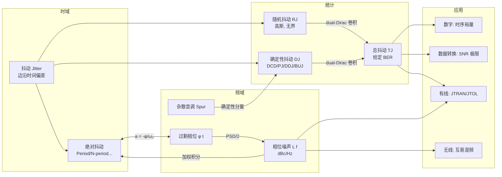

# Understanding Jitter and Phase Noise — 学习笔记总览

> [!info] 书目信息
> - **书名**：Understanding Jitter and Phase Noise: A Circuits and Systems Perspective（理解抖动与相位噪声：电路与系统视角）
> - **作者**：Nicola Da Dalt（Intel 高速串行接口模拟工程经理）、Ali Sheikholeslami（多伦多大学 ECE 教授）
> - **出版**：Cambridge University Press, 2018
> - **原文笔记**：[[eetop.cn_Understanding Jitter and Phase Noise-A Circuits and Systems Perspective 2018]]

> [!abstract] 本书一句话
> 系统回答抖动（Jitter）与相位噪声（Phase Noise）的四个核心问题：**如何产生、如何量化、如何损害电路与系统性能、如何仿真与抑制**——覆盖数字、数据转换、有线、无线四大应用领域。

---

## 📚 笔记地图

### 第一部分：理论基础（所有读者的必读路径）

| 笔记 | 内容 | 关键词 |
|---|---|---|
| [抖动导论](抖动导论.md) | 直观认识时钟抖动与数据抖动 | 周期抖动、绝对抖动、眼图、故意抖动 |
| [抖动基础与统计](抖动基础与统计.md) | 抖动的形式化定义与统计描述 | TIE、N 周期抖动、RJ/DJ 分解、dual-Dirac |
| [抖动与相位噪声的关系](抖动与相位噪声的关系.md) | **全书理论核心**：时域抖动 ↔ 频域相位噪声 | 过剩相位、L(f)、权重函数、杂散 |

### 第二部分：电路机理

| 笔记 | 内容 | 关键词 |
|---|---|---|
| [电路中的抖动与相位噪声](电路中的抖动与相位噪声.md) | 抖动/相位噪声在基本电路与振荡器中的产生机理 | kT/C、Leeson 模型、ISF、FOM、分频/倍频 |

### 第三部分：四大应用领域（相对独立，按需选读）

| 笔记 | 面向读者 | 关键词 |
|---|---|---|
| [同步数字电路中的抖动](同步数字电路中的抖动.md) | 数字设计工程师 | 建立/保持时间裕量、锁存器设计 |
| [数据转换器中的抖动](数据转换器中的抖动.md) | 混合信号工程师 | 采样 SNR 极限、IDAC、时间交织 skew、CT ΣΔ |
| [有线通信中的抖动](有线通信中的抖动.md) | SerDes 工程师 | CDR、JTRAN/JGEN/JTOL、Bang-Bang、眼图监测 |
| [无线应用中的相位噪声](无线应用中的相位噪声.md) | RF/无线工程师 | 阻塞、互易混频、VCO 相位噪声指标 |

### 第四部分：进阶与工具

| 笔记 | 内容 | 关键词 |
|---|---|---|
| [高级专题](高级专题.md) | 数学深入（可后读） | 相位噪声→抖动通用方法、置信区间、Allan 偏差、Lorentzian |
| [数值方法与Matlab仿真](数值方法与Matlab仿真.md) | 瞬态仿真中生成/分析抖动 | 相位噪声轮廓→抖动样本、尾部拟合 |
| [附录 随机过程复习](附录 随机过程复习.md) | 全书数学基础速查 | 随机变量、PSD、Wiener–Khinchin、遍历性 |

---

## 🗺️ 推荐学习路径（依据原书前言的阅读指引）

> [!tip] 按需选择路径
> - **通用基础（所有人）**：[01](抖动导论.md) → [02](抖动基础与统计.md) → [03](抖动与相位噪声的关系.md)
> - **模拟/振荡器 IC 设计**：基础路径 + [04](电路中的抖动与相位噪声.md)
> - **数字设计**（可跳过相位噪声）：[01](抖动导论.md) → [02](抖动基础与统计.md) → [05](同步数字电路中的抖动.md)
> - **数据转换器**：基础路径 + [06](数据转换器中的抖动.md)
> - **SerDes/有线通信**：基础路径 + [07](有线通信中的抖动.md)（建议加 [04](电路中的抖动与相位噪声.md)）
> - **无线/RF**：基础路径 + [08](无线应用中的相位噪声.md)（[03](抖动与相位噪声的关系.md) 为必读）
> - **数学理论深入**：基础路径 + [09](高级专题.md)
> - **仿真实践**：任意路径 + [10](数值方法与Matlab仿真.md)（数学不熟先查 [11](附录 随机过程复习.md)）

---

## 🧠 核心概念关系图

---

## ✅ 学习检查清单

- [ ] 能区分绝对抖动、周期抖动、N 周期抖动、TIE，并说出它们的适用场景
- [ ] 能用 dual-Dirac 模型解释 TJ = DJ + 2·Q·RJ（给定 BER）
- [ ] 掌握 a_k = -φ_k/ω₀ 这一时频域桥梁公式
- [ ] 能从 L(f) 积分计算各类 RMS 抖动（含权重函数）
- [ ] 理解 Leeson 模型的三个频谱区域与 1/f² 整形
- [ ] 理解 ISF 的物理意义：为何过零点注入噪声影响最大
- [ ] 理解分频降 20logN dB、倍频升 20logN dB 相位噪声
- [ ] 会算 ADC 采样抖动 SNR 极限：SNR = -20log₁₀(2πf_in·σ_j)
- [ ] 能区分 JTRAN / JGEN / JTOL 并解释其频率特性
- [ ] 能用互易混频推导 VCO 近端相位噪声要求
- [ ] （进阶）理解 Allan 偏差与相位噪声的幂律对应关系
- [ ] （进阶）能用 Matlab 生成指定相位噪声轮廓的抖动序列

---

## 📖 业界评价（原书封底推荐）

> "Pushing the envelope requires a thorough understanding of jitter from its mathematical description, to its manifestation in circuits and its impact on systems." — **Boris Murmann**, Stanford

> "This book is a necessity for all designers who have to know about noise and its performance limitations." — **Willy Sansen**, KU Leuven

> "The only book that I know which covers all of these subjects, providing both the intuitive understanding and the appropriate mathematical rigour." — **Carlo Samori**, Politecnico di Milano
