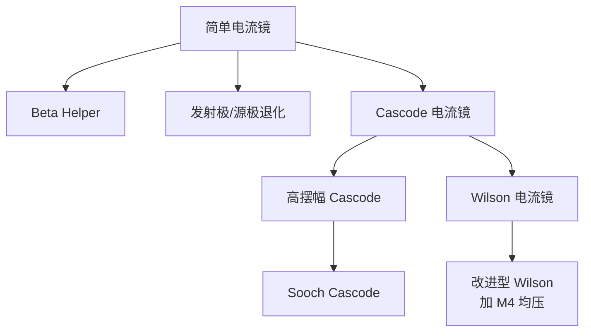

# 第4章：电流镜、有源负载与基准源

## 本章定位

本章是 Gray 模拟集成电路教材的核心章节之一，系统阐述了电流镜、有源负载和电压/电流基准三大模块。这三者构成了模拟 IC 中偏置电路和放大级负载的基石。本章承上启下——以第3章放大器为基础，为第6章运算放大器设计提供关键电路模块。

## 核心概念

### 1. 电流镜的四个性能参数

所有电流镜结构都通过四个参数进行比较：

- **输出电阻 $R_o$**：衡量输出电流随输出电压变化的程度。$R_o$ 越高，电流越接近理想恒流源。
- **系统增益误差 $\epsilon$**：即使完全匹配时仍存在的增益偏差，来源包括有限输出电阻和有限 $\beta_F$（BJT）。
- **输入电压 $V_\text{IN}$**：电流镜输入端产生的压降，限制输入电流源在低压应用中的设计余量。
- **最小输出电压 $V_\text{OUT(min)}$**：使输出管工作在放大区的输出电压下限，决定放大器输出摆幅。

### 2. 有源负载的核心思想

> 用晶体管的 $r_o$ 代替电阻作为放大器的负载元件，以较少的直流压降获得高增益。

$$
\text{增益} \propto g_m \cdot (r_{o1} \parallel r_{o2})
$$

- BJT：增益与偏置电流**无关**（$g_m \propto I_C$，$r_o \propto 1/I_C$），典型值 1000--2000。
- MOS：增益与偏置电流**平方根成反比**（平方律区），典型值 10--100。

### 3. 带隙基准的基本思想

> 将负温度系数的 $V_{BE}$ 与正温度系数的热电压 $V_T$ 按权重叠加，在特定温度点获得零温度系数。

$$
V_\text{OUT} = V_{BE} + M \cdot V_T
$$

零温度系数时的输出电压接近硅的带隙电压 $\approx 1.205\text{ V}$，故得名 "band-gap reference"。

---

## 关键公式与结论

### 电流镜

| 结构 | 输出电阻 | 系统增益误差 | $V_\text{IN}$ | $V_\text{OUT(min)}$ |
|------|---------|-------------|---------------|---------------------|
| **简单BJT** | $r_{o2}$ | $\frac{V_{CE2}-V_{CE1}}{V_A} - \frac{2}{\beta_F}$ | $V_{BE(on)}$ | $V_{CE(sat)}$ |
| **简单MOS** | $r_{o2}$ | $\frac{V_{DS2}-V_{DS1}}{V_A}$ | $V_t + V_{ov}$ | $V_{ov}$ |
| **Cascode BJT** | $\frac{\beta_0 r_o}{2}$ | $-\frac{4}{\beta_F}$ | $2V_{BE(on)}$ | $2V_{BE(on)}$ |
| **Cascode MOS** | $g_m r_o \cdot r_o$ | 0（$V_{DS}$ 相等时） | $2(V_t+V_{ov})$ | $V_t + 2V_{ov}$ |
| **Wilson BJT** | $\frac{\beta_0 r_o}{2}$ | 有限 $\beta_F$ 误差极小 | $2V_{BE(on)}$ | $2V_{BE(on)}$ |
| **Wilson MOS** | $g_m r_o \cdot r_o$ | $-\frac{V_{GS2}}{V_A}$（无 $M_4$） | $V_t + 2V_{ov}$ | $V_t + 2V_{ov}$ |

### BJT 简单电流镜增益公式

$$
I_{OUT} = \frac{I_{S2}}{I_{S1}} \cdot \frac{I_{IN}}{1 + \frac{2}{\beta_F}}
$$

增益误差 $\epsilon = \frac{V_{CE2} - V_{CE1}}{V_A} - \frac{2}{\beta_F}$

### MOS 简单电流镜增益公式

$$
I_{OUT} = \frac{(W/L)_2}{(W/L)_1} \cdot I_{IN}
$$

> [!tip] 设计要点
> 通常只 ratio 宽度 $W$ 而不 ratio 长度 $L$，因为有效沟道长度的偏移量与 $L_{drawn}$ 无关，ratio 长度会引入工艺依赖的误差。

### Widlar 电流源（BJT）

$$
V_T \ln\frac{I_{IN}}{I_{OUT}} = I_{OUT} R_2
$$

- 用一个小电阻 $R_2$ 即可将输出电流从 mA 级降到 $\mu\text{A}$ 级。
- 电源灵敏度远优于简单电流镜：10% 电源电压变化仅导致约 1.6% 输出电流变化。

### 自偏置与启动电路

自偏置（self-biasing/bootstrap）的核心：使输入电流依赖于输出电流本身，而非通过电阻连到电源，从而大幅降低电源灵敏度。

> [!warning] 启动电路
> 自偏置电路存在零电流稳定态（$\approx$ pA 级漏电流使环路增益 < 1），**必须**外加启动电路注入初始电流使电路脱离零态。启动电路在稳态下应自动断开，不影响正常工作。

### 带隙基准温度特性

$$
V_{OUT}(T) = V_{G0} + (\gamma - \alpha) V_{T0} \left[ \frac{T}{T_0} - \frac{T}{T_0} \ln\frac{T}{T_0} \right]
$$

零 $TCF$ 时：$V_{OUT} \approx V_{G0} + (\gamma - \alpha) V_{T0}$

- $\gamma \approx 3.2$（硅的工艺参数），$\alpha$ 取决于偏置电流的温度特性
- PTAT 电流的 $\alpha = 1$，零 $TCF$ 时 $V_{OUT} \approx 1.262\text{ V}$（27°C）

### CMOS 带隙基准的失调影响

$$
V_{OUT(referred\_offset)} = \left(1 + \frac{R_2}{R_3}\right) V_{OS}
$$

输入失调电压被放大了 $(1 + R_2/R_3)$ 倍！这是 CMOS 带隙基准中 $TCF$ 不准的主要来源。

### 差分对有源负载

- **差模跨导**：$G_m[dm] = g_m$（有源负载使跨导翻倍，因为电流镜创造了第二条信号通路）
- **输出电阻**：$R_o = r_{o(dp)} \parallel r_{o(mir)}$
- **差模电压增益**：$A_{dm} = g_m (r_{o(dp)} \parallel r_{o(mir)})$
- **CMRR 提升因子**：$\approx \frac{2}{\epsilon_d + \epsilon_m}$，远优于电阻负载差分对

---

## 重要电路结构

### 4.2 电流镜族谱

#### (1) Beta Helper（BJT 专用）

在简单电流镜的输入端插入射随器，将 $\beta_F$ 造成的增益误差减小 $(\beta_F+1)$ 倍。多输出电流镜和 $pnp$ 电流镜（$\beta_F$ 较小）的必备。

#### (2) Cascode 电流镜

- **BJT cascode**：$R_o \approx \frac{\beta_0 r_o}{2}$，但有限 $\beta_F$ 误差为 $-4/\beta_F$（比简单电流镜的 $-2/\beta_F$ 更差）。
- **MOS cascode**：$R_o \approx g_m r_o \cdot r_o$，每叠一层 cascode 输出电阻乘 $(g_m r_o)$ 倍。理论无上限。但衬底漏电路径可能成为主导。

#### (3) 高摆幅 Cascode（High-Swing Cascode）

关键问题：常规 cascode 中 $V_{DS1} \approx V_t + V_{ov}$，比 $M_1$ 进入饱和区所需的 $V_{ov}$ 高了一个 $V_t$。

解决方案：
- **电平移位法**（图 4.11）：用源随器将栅极电压降低一个阈值。
- **Sooch 电路**（图 4.12）：用深三极管区 $M_5$ 产生精确 $V_{ov}$ 压降，使 $V_{DS1} = V_{ov}$。$M_4$ 用于均衡 $M_3$ 和 $M_1$ 的漏源电压，消除系统增益误差。

$$
V_\text{OUT(min)} = 2V_{ov} \quad (\text{无阈值损失！})
$$

#### (4) Wilson 电流镜

- **BJT**：通过负反馈克服 cascode 中 $\beta_F$ 误差大的问题。$\beta_F$ 误差约为 $2/\beta_F^2$。
- **MOS**：需加 $M_4$ 均衡 $M_3$ 与 $M_1$ 的 $V_{DS}$，否则系统增益误差 $\approx -V_{GS2}/V_A$。

### 4.3 有源负载放大器

| 结构 | 增益范围 | 特点 |
|------|---------|------|
| CE/CS + 电流镜负载 | BJT: 1000-2000, MOS: 10-100 | 高增益，最常用 |
| CS + 耗尽型负载 | MOS: $\approx g_{m1}/(g_{mb2})$ | 受体效应限制 |
| CS + 二极管连接负载 | MOS: $\approx \sqrt{(W/L)_1/(W/L)_2}$ | 低增益(< 20)，高线性度，宽带 |
| 差分对 + 电流镜负载 | 同 CE/CS | 差分转单端 + 高 CMRR |

#### 差分对有源负载的关键特性

> [!important] 差分转单端转换
> 有源负载差分对自动完成差分输入到单端输出的转换，且 CMRR 远高于单端输出的电阻负载差分对。

$$
CMRR_{active} \approx CMRR_{passive} \times \frac{2}{\epsilon_d + \epsilon_m}
$$

其中 $\epsilon_d$ 为差分对增益误差，$\epsilon_m$ 为电流镜增益误差。

### 4.4 基准源

#### Widlar 电流源（低电流偏置）

| | BJT | MOS |
|---|---|---|
| 方程 | $V_T \ln(I_{IN}/I_{OUT}) = I_{OUT}R_2$ | 见 (4.197) 闭合解 |
| 电源灵敏度 | $\approx 0.16$ | $\approx 0.5$ |
| 适用 | $\mu\text{A}$ 级偏置 | 同左 |

#### Peaking 电流源

输出电流随输入电流先增后减——存在峰值。适合 nA 级超低电流偏置。MOS 版本在弱反型区工作时方程与 BJT 版本相同（仅 $n$ 因子有差异）。

#### 带隙基准演进

- **PTAT 电流**：Proportional To Absolute Temperature，$I_{OUT} = \frac{V_T \ln n}{R}$，温度系数由 $V_T$ 和 $R$ 的温度系数之差决定。
- **自偏置 VT 基准**（图 4.41）：$I_{OUT} = \frac{V_T \ln 2}{R_2}$，$TCF$ 远小于 $V_{BE}$ 基准。
- **Curvature compensation**：$V_{BE}$ 的温度系数并非严格常数，仅能在一个温度点实现零 $TCF$。更高级电路补偿二次曲率效应。

### 附录：匹配与失调

- **BJT 电流镜匹配**：$g_m R_E \ll 1$ 时由 $I_S$ 失配主导；$g_m R_E \gg 1$ 时由电阻失配主导。发射极退化可大幅改善匹配。
- **MOS 电流镜匹配**：$\frac{\Delta I_D}{I_D} = \frac{\Delta(W/L)}{W/L} - \frac{\Delta V_t}{V_{ov}/2}$。减 $V_{ov}$ 会使阈值失配的影响增大。
- **电压偏置布线 vs 电流偏置布线**：电流布线匹配好但占用互连线多；电压布线省面积但存在阈值梯度和电源电阻问题。实际 IC 中全局用电流布线、局部用电压布线。
- **有源负载差分对失调**：BJT 中比电阻负载差分对大（来自负载管有限 $\beta_F$ 和 $I_S$ 失配）；MOS 中有 $\Delta V_t$ 和 $\Delta(W/L)$ 贡献。

---

## 设计启示

1. **大电流比**（> 5:1）不要直接 ratio 器件面积——用 Widlar 电流源或发射极退化电阻 ratio。
2. **Cascode** 提升输出电阻最直接，MOS 中可无限堆叠，但要关注低压裕度（每层多消耗 $V_{ov}$）。
3. **高摆幅 Cascode**（Sooch/电平移位型）是目前最实用的方案——输出电阻高且最小输出电压仅 $2V_{ov}$。
4. **MOS Wilson** 务必加 $M_4$ 均压，否则系统增益误差 > 零。
5. **有源负载放大器**的输出电阻高，后级必须有高输入阻抗才能实现最大增益（MOS 天然满足，BJT 需考虑 $r_\pi$ 负载效应）。
6. **自偏置必须带启动电路**——芯片在生产测试中会遇到零电流"死锁"。
7. **CMOS 带隙基准**中，$V_{OS}$ 被 $(1+R_2/R_3)$ 倍放大，应尽量增大 $\Delta V_{EB}$（通过 ratio 电流和射极面积）来降低所需增益 $M$。
8. **PTAT 电流源**的温度系数比 $V_{BE}$ 基准小得多，是片上偏置的首选。
9. **匹配**方面：MOS 减 $V_{ov}$ 提高 $g_m/I_D$ 效率但恶化阈值失配；BJT 加 $R_E$ 退化改善匹配但增大 $V_\text{IN}$ 和 $V_\text{OUT(min)}$。

---

## 章节关联

- **前一章**：[[Ch03 - Single-Transistor and Multiple-Transistor Amplifiers]] — 本章的电流镜和差分对分析直接依赖于单管/多管放大器的小信号模型
- **后续章节**：
  - [[Ch06 - Operational Amplifiers with Single-Ended Outputs]] — 本章的差分对有源负载是运放输入级基础
  - [[Ch07 - Frequency Response of Integrated Circuits]] — 本章仅讨论直流/低频，频率响应的分析延至第7章
  - [[Ch08 - Feedback]] — 本章 Wilson 电流镜的反馈效应、CMRR 提升在第8章深入分析
  - [[Ch09 - Frequency Response and Stability of Feedback Amplifiers]] — 自偏置的正反馈稳定性分析
  - [[Ch12 - Fully Differential Operational Amplifiers]] — 共模反馈 (CMFB) 电路

## See Also

- PLL 相关笔记中对电流源/基准源噪声的分析

## 检索关键词

`current mirror` `Widlar current source` `Wilson current mirror` `cascode current mirror` `high-swing cascode` `Sooch cascode` `active load` `differential pair with current-mirror load` `bandgap reference` `PTAT current` `beta helper` `self-biasing` `start-up circuit` `supply sensitivity` `common-mode rejection ratio` `CMRR` `matching` `offset voltage` `emitter degeneration` `current routing` `voltage routing` `curvature compensation`

---

Sources: [[raw/模拟集成电路/Gray/Ch04 - Current Mirrors, Active Loads, and References]]
